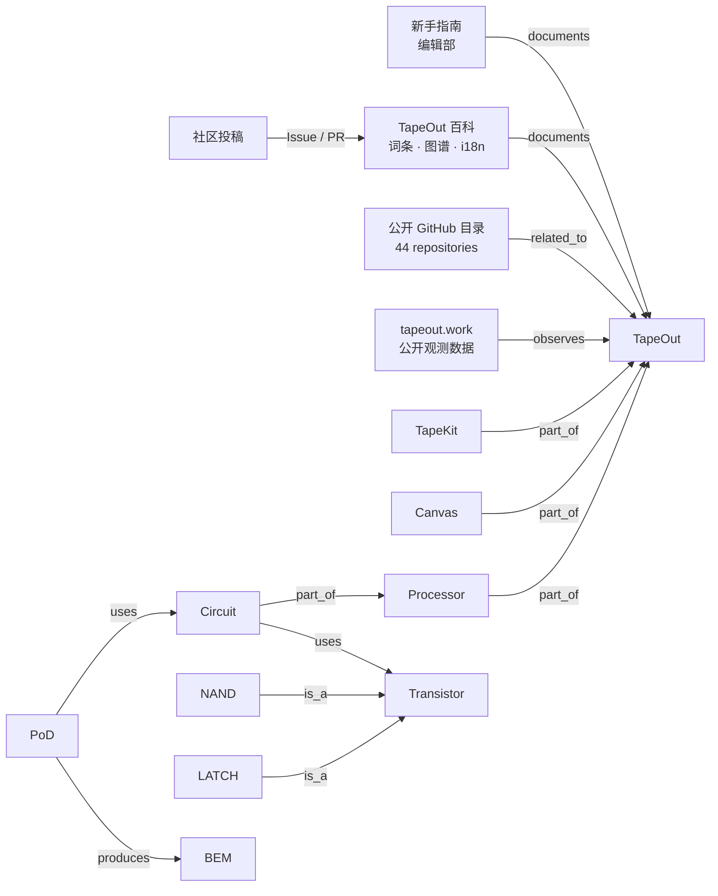

# TapeOut 知识图谱概览

当前快照：**86 个实体 · 91 条关系 · 44 个匿名验证的公开 GitHub 仓库**。

> 这是便于在 GitHub 上阅读的核心关系概览。完整节点与边以 YAML 和 DOT 文件为准。

## 浏览完整图谱

- [百科核心实体](entities.yaml)
- [百科核心关系](relations.yaml)
- [公开仓库节点与关系](public-github.yaml)
- [完整 DOT 图谱](graph.dot)
- [公开 GitHub 仓库目录](../public-github/README.zh-CN.md)

运行 `npm run content` 会从公开仓库目录同步仓库节点，并重新生成本页与完整 DOT 图谱。
